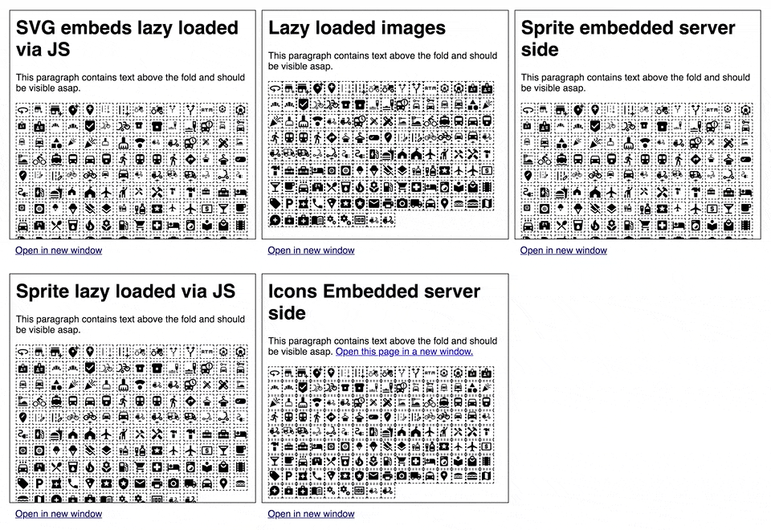

# svg-loading-strategies

Comparsion between SVG Icon loading strategies.
The results may differ when using more, less, smaller or bigger icons. Even combinations of different strategies e.g. using single embeds for big SVGs and sprites for small icons have different results.
There also are some benefits in lazy loading single files only when needed (in viewport) that are not covered by the results (only described in pros/cons).
The test assumes efficient compression strategies for the HTML and Asset Files e.g. gzip or [Brotli](https://github.com/google/brotli). It also assumes the page is served via HTTP/2 so [multiplexing](https://developers.google.com/web/fundamentals/performance/http2#request_and_response_multiplexing) is enabled.
[Preloading content](https://developer.mozilla.org/en-US/docs/Web/HTML/Preloading_content) also could have a positive effect.
Sometimes even using PNG files could make more sense.

## Demo

<a href="https://svg-loading-strategies.netlify.app/index.htm" target="_blank">https://svg-loading-strategies.netlify.app/index.htm</a>



## Strategies

### 1. Lazy embeds

Each icon is loaded separately via JavaScript and embedded into to the DOM.

**Before initialization**

```html
<svg data-url="asset-url.svg"></svg>
```

**After initialization**

```html
<svg><path d="M0 0h24v24H0z"></path></svg>
```

| Pros                                                                                      | Cons                                                                                                                                                            |
| ----------------------------------------------------------------------------------------- | --------------------------------------------------------------------------------------------------------------------------------------------------------------- |
| Efficient Caching since each Icon will get resolved by a separate GET request.            | Browser has to work a lot since after download it has to manipulate the DOM. Also depending on the implementation it maybe has to parse the SVG response first. |
| It is possible to just embed the SVG icons needed on the current page                     | Only works when JavaScript is available.                                                                                                                        |
| Works asyncronously                                                                       | Lots of network requests.                                                                                                                                       |
| More granular progressive loading because of the size of the assets compared to a sprite. |                                                                                                                                                                 |

### 2. Lazy images

Simple image tag with lazy loading attribute.

```html

```

| Pros                                                                                                                   | Cons                                  |
| ---------------------------------------------------------------------------------------------------------------------- | ------------------------------------- |
| Efficient Caching since each Icon will get resolved by a separate GET request.                                         | Styling of the icons is not possible. |
| It is possible to just embed the SVG icons needed on the current page                                                  | Lots of network requests.             |
| Works asyncronously.                                                                                                   |                                       |
| More granular progressive loading because of the size of the assets compared to a sprite.                              |                                       |
| No JavaScript needed for modern browsers with [natively supported lazy loading](https://caniuse.com/loading-lazy-attr) |                                       |

### 5. Sprite embedded server side

**Sprite embedded in body**

```html
<svg
  xmlns="http://www.w3.org/2000/svg"
  xmlns:xlink="http://www.w3.org/1999/xlink"
  style="position: absolute; width: 0; height: 0"
  aria-hidden="true"
>
  <defs>
    <symbol
      id="asset-id"
      xmlns="http://www.w3.org/2000/svg"
      height="24"
      viewBox="0 0 24 24"
      width="24"
    >
      <path d="M0 0h24v24H0z" fill="none"></path>
    </symbol>
    ...
  </defs>
</svg>
```

**SVG icons using the reference**

```html
<svg viewBox="0 0 24 24" width="24" height="24">
  <use xlink:href="#asset-id" />
</svg>
```

Sprite is embedded server side and is delivered with each HTML file.
The HTML should look the same as in strategy 4 when loading with JavaScript.
| Pros | Cons |
| ---------------------------------------------------------------------------------------------------------------------------------- | ---------------------------------------------------------------------------------------------------------------------------------------------------------------------------------------------------------------------------- |
| Bigger DOM is blocking the [FCP](https://web.dev/first-contentful-paint/). | Each icon is loaded even when not needed on the current page. |
| No JavaScript needed. | Inefficient caching (client side) since the same icon is not cacheable by the client when visiting different sites. |
| When using the same icon on one page twice it is a better choice compared to single embeds. |Server has more work to do before cache when compressing the same iconset for lots of pages again and again. |

### 4. Sprite loaded and embedded with JavaScript

Sprite is loaded asynchronously and embedded to the DOM by JavaScript

**Sprite after embedded by JS in body**

```html
<svg
  xmlns="http://www.w3.org/2000/svg"
  xmlns:xlink="http://www.w3.org/1999/xlink"
  style="position: absolute; width: 0; height: 0"
  aria-hidden="true"
>
  <defs>
    <symbol
      id="asset-id"
      xmlns="http://www.w3.org/2000/svg"
      height="24"
      viewBox="0 0 24 24"
      width="24"
    >
      <path d="M0 0h24v24H0z" fill="none"></path>
    </symbol>
    ...
  </defs>
</svg>
```

**SVG icons using the reference**

```html
<svg viewBox="0 0 24 24" width="24" height="24">
  <use xlink:href="#asset-id" />
</svg>
```

| Pros                                                                                                                               | Cons                                                                                                                                                                                                                         |
| ---------------------------------------------------------------------------------------------------------------------------------- | ---------------------------------------------------------------------------------------------------------------------------------------------------------------------------------------------------------------------------- |
| Efficient Caching (server side) since the sprite is build and compressed once. Clients will request the same sprite for each page. | Each icon is loaded even when not needed on the current page.                                                                                                                                                                |
| Works asynchronously.                                                                                                              | Browser has to work a lot since after download it has to parse the JS containing the SVG-Sprite and manipulate the DOM. (maybe loading the SVG from a separate SVG file and not from a JavaScript file is a better solution) |

### 5. Embeds

Embed each icon when needed.

```html
<svg><path d="M0 0h24v24H0z"></path></svg>
```

\* When embedding the 100 icons 3 times andthe transferred data increased from 22 to 56kB and when using 6 times (600 icons) the transferred data increased from 22 to 111kB.

| Pros                                                       | Cons                                                                                                                                                                                 |
| ---------------------------------------------------------- | ------------------------------------------------------------------------------------------------------------------------------------------------------------------------------------ |
| Efficient Caching (server side) since the SVG is embedded. | Larger HTML files compared to the strategies with placeholder functionality.                                                                                                         |
| No extra network requests.                                 | Inefficient caching (client side) since the same icon is not cacheable by the client when visiting different sites. (maybe gzip/brotli will help for the same Icon on the same page) |
| Easy to implement.                                         | Server has more work to do before cache when compressing the same icon for lots of pages again and again.                                                                            |
| No JavaScript needed.                                      |                                                                                                                                                                                      |

## Comparison

### Test setup

Loading 100 SVG Icons from the [google Material design library](https://github.com/google/material-design-icons/) with different strategies.
There is an index.html with each strategy shown in a separate iframe. Because of network concurrency i would not recommend to use this for comparison reasons. If you want to get an impression on how the loading strategy will affect the loading behaviour in your browser use the separate scenarios.
The following table contains Lighthouse results generated by [Lighthouse CLI](https://github.com/GoogleChrome/lighthouse#using-the-node-cli). The results are representing the median of 50 tests per Site.
If you get better results when loading in the browser, Lighthouse CLI emulates a mid-tier mobile device with CPU and Network throttling.
For some reason Netlify, where the demo is hosted, does not use Brotli to compress SVG Files. So the strategies depending on downloading each SVG file individually may have better results when compressing the assets.

#### Transferred Data

|                  | Lazy Embeds | Images | Sprite Server Side | Sprite JS | Embeds     |
| ---------------- | ----------- | ------ | ------------------ | --------- | ---------- |
| Requests         | 140         | 139    | **2**              | 3         | **2**      |
| Transferred Data | 88.1kB      | 105kB  | 22.6kB             | 27.5kB    | **20.7kB** |

### Lighthouse CLI median (50 tests)

|                                                                                                       | Lazy Embeds      | Images         | Sprite Server Side | Sprite JS       | Embeds           |
| ----------------------------------------------------------------------------------------------------- | ---------------- | -------------- | ------------------ | --------------- | ---------------- |
| [Performance score](https://developers.google.com/speed/docs/insights/v5/about)                       | 100              | 100            | 100                | 100             | 100              |
| [First Contentful Paint](https://web.dev/first-contentful-paint/)                                     | 1.012s           | 1.246s         | 1.040s             | 857ms :running: | 1.030s           |
| [Speed Index](https://web.dev/speed-index/)                                                           | 1.026s           | 1.596s         | 1.040s             | 883ms :running: | 1.030s           |
| [Largest Contentful Paint](https://web.dev/lcp/)                                                      | 1.162s           | 1.246s         | 1.040s             | 1.247s :turtle: | 1.030s :running: |
| [Time to Interactive](https://web.dev/interactive/)                                                   | 1.012s :running: | 1.246s         | 1.055s             | 1.247s :turtle: | 1.030s           |
| [Total Blocking Time](https://web.dev/lighthouse-total-blocking-time/)                                | 0                | 0              | 0                  | 100ms :turtle:  | 0                |
| [DOMContentLoaded Event](https://developer.mozilla.org/de/docs/Web/API/Window/DOMContentLoaded_event) | 248ms            | 256ms          | 209ms :running:    | 339ms :turtle:  | 213ms            |
| [Load Event](https://developer.mozilla.org/en-US/docs/Web/API/Window/load_event)                      | 310ms            | 535ms :turtle: | 225ms :running:    | 347ms           | 251ms            |

## Verdict

There is no recommendation i wanted to give in the first place. I just wanted to know if there are major differences since we evaluated different solutions to load SVG files for an upcoming project.
There are way to many parameters to consider before deciding for one solution as i mentioned in the intro. Even compression time on the server could be a valid parameter.

Using the JavaScript Sprite strategy seemed to be the go-to solution for a lot of our projects since there are handy loaders for Webpack doing the work for you. But to avoid using JavaScript if there are other possibilities is often something to consider. Especially when thinking about performance since the Browser always has to [work a little more](https://v8.dev/blog/cost-of-javascript-2019). That also should be the reason for the worst "Totel Blocking Time" and "Time to Interactive" for the SVG Sprite via JavaScript strategy.
